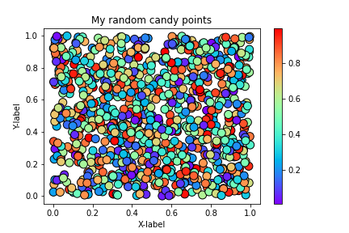

## Problem 1: Simple scatter plot using random 

The aim of this task is to create a simple scatter plot using random input values and random colors!
Finally, you will save the plot as `.png` file that should look something like this: 
 
 
 
**NOTE**: You colors may look different from the image above depending on the version of Matplotlib you are using!
 
### Hint: generating random numbers

We can generate random numbers using using a method `random.rand()` from the [NumPy package](https://numpy.org/). This example generates 10 random values:

```
import numpy as np
random_numbers = np.random.rand(10)

```

this produces an array object `random_numbers` that could look, for example, like this (each time you run the code you get a different set of random numbers!):

``` 
array([0.30888937, 0.02648327, 0.62740074, 0.75795089, 0.41083545,
       0.91937694, 0.90100588, 0.33312242, 0.39950947, 0.8181788 ]
``` 


You can insert this array into a column in a pandas data frame, assuming that the array length and data frame length match:

```
...

data["new_column"] = random_numbers
```


### Part 1

Create an new data frame called `data` and add 1000 random numbers (`float`) into a new column `x` and another 1000 random numbers (`float`) into a new column `y`.


```python
import numpy as np
import pandas as pd

# YOUR CODE HERE 1 to set data 
```


```python
# Check your random values
print(data.head())

# Check that you have the correct number of rows
assert len(data) == 1000, "There should be 1000 rows of data."
```

### Part 2

Create a variable `colors` in which you should store 1000 random colors so that we get a little bit of sweeter looking plot.

The variable `colors` should be an array full of random numbers.


```python
# YOUR CODE HERE 2 to set colors
```


```python
# This test print should print out 10 first numbers in the variable colors
print(colors[0:10])

# Check that the length matches
assert len(colors) == 1000, "There should be 1000 random numbers for colors"
```

### Part 3 

#### Part 3.1

Create a scatter plot of points with random colors

Plot a scatter plot using `DataFrame.plot()`:
- set the type of the plot using parameter `kind=scatter` (OR use `DataFrame.plot.scatter()`)
- modify the size of a point using parameter `s` (the example plot uses `s=50`)
- set the random colors for the points using parameter `c`
- set the color scheme using parameter `colormap`. 
    - The example image uses colormap `'rainbow'`
    - you can also choose another color map from here: https://matplotlib.org/3.1.0/tutorials/colors/colormaps.html
    - you can add a black outline for the points using the parameter `edgecolor`. The example uses `edgecolor=black`.

#### Part 3.2

Add s title, x-label and y-label to your plot as shown in the example figure:

- create variables `title`, `xlabel` and `ylabel` and store the title and axis labels texts in them
- use `matplotlib.pyplot` methods to add the title and labels to the figure

**Feel free to change the colors and markers in the plot :)**

#### Part 3.3

Create a variable `outputfp` with the output filename `my_first_plot.png` and save your plot as a PNG file into the disk (note: you have to save the file in the same code cell where you do the plotting). 


```python
%matplotlib inline

# Plot a scatter plot
# YOUR CODE HERE 3

# Add labels and title
# YOUR CODE HERE 4

# Save the plot as a png file:
outputfp = "my_first_plot.png"

# YOUR CODE HERE 5

# This test print statement should print the output filename of your figure
print("Saved my first plot as:", outputfp)
```


```python
#Check that the file exists (also go and open the file to check that everything is ok!)
import os

assert os.path.exists(outputfp), "Can't find the output image."
```

Remember to commit your changes (including the image file) to your GitHub repo!

### Done!

Now you can move to [problem 2](Exercise-7-problem-2.ipynb).
